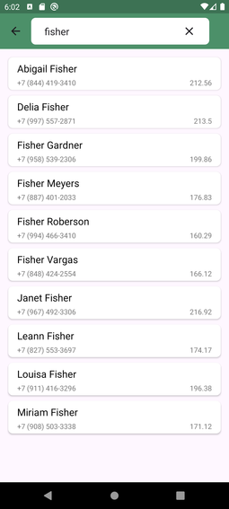

Contact List
-

Простое мультимодульное приложение. Приложение при запуске скачивает из 3 источников контакты (7500шт) и отображает в списке. Каждый контакт можно открыть для просмотра дополнительной информации.

Стек:
- Android SDK
- Room
- Hilt
- Coroutines
- Retrofit
- Navigation Component
- SearchView
- SwipeRefreshLayout
- SplashScreen
- Paging3

==

Загрузка контактов и общий список.

 

==

Поиск.

==

Info fragment.

